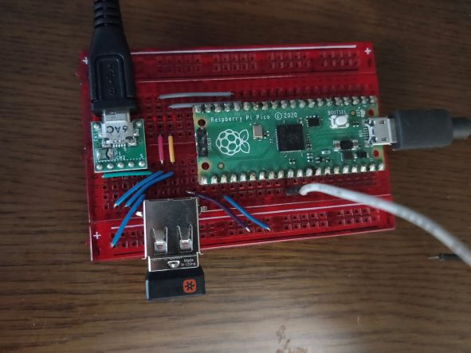
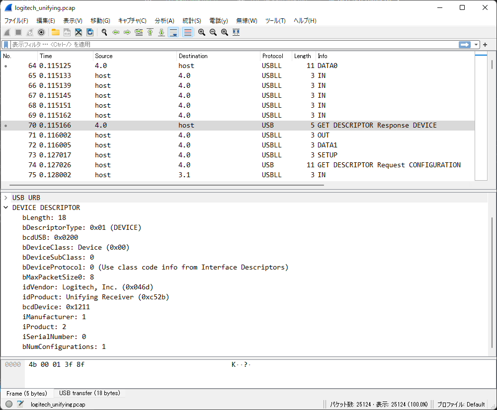

# USB sniffer using Raspberry Pi Pico
A USB sniffer using Raspberry Pi Pico.

It implements a USB sniffer using only a **single chip** (RP2040 microcontroller), thanks to its **Programmable IO (PIO) module, dual cores, and DMA**.

Despite the hardware is very simple, it can capture packets on a USB cable with minimal interference with devices under test, similar to professional USB analyzers.

Captured packets are saved as a `.pcap` file and can be analyzed using [Wireshark](https://www.wireshark.org/).




Example capture file: [logitech_uniftying.pcap](docs/logitech_unifying.pcap)

## Usage
### Wiring
Connect **USB D+ to Raspberry Pi Pico's GPIO 11**, **USB D- to GPIO 12**, and **USB GND to Pico's GND**.

### Capturing script
Use the Python script `tools/pico_usb_sniffer.py`.
This scripts requires Python 3 interpreter, as well as [pyserial](https://github.com/pyserial/pyserial) and [sliplib](https://github.com/rhjdjong/SlipLib) libraries.
```
usage: pico_usb_sniffer.py [-h] [-o OUTPUT] [-i [PID ...]] port

positional arguments:
  port                  name of the serial port (e.g. COM1 on Windows or /dev/ttyACM0 on Linux).

optional arguments:
  -h, --help            show this help message and exit
  -o OUTPUT, --output OUTPUT
                        path of output file. '-' indicates stdout. Default is '-'.
  -i [PID ...], --ignore-pids [PID ...]
                        Packet Identifiers (PIDs, e.g. SOF or ACK) to ignore. Case-insensitive.
```

## Limitations
- **Quite sensitive to signal degradation**. This is because it uses single-ended GPIO ports instead of a differential receiver. For robust capture, the following mitigations are useful (although you may still get corrupted packets even with these mitigations):
    - Use short cables.
    - Put a signal repeating device (e.g. an USB hub, or an isolator based on [ADuM3160](https://www.analog.com/en/products/adum3160.html#product-overview)) between the sniffer and the device under test. Dongle-shaped one or one with very short cable is the most preferable.
- Only **Full Speed** mode is supported. Low or High Speed packets on the same bus may prevent entire capturing.
    - The aforementioned USB isolator is also useful to force a High Speed capable DUT to use Full Speed.
- Because it sends captured USB Full Speed packets via USB serial port (which also uses Full Speed), **it cannot capture all packets when USB bandwidth is fully utilized**.

## Known issues
- Sometimes, the sniffer itself (Raspberry Pi Pico) is not recognized by a PC. If the serial port of the Pico does not appear, plug the Pico into your PC again.

## See also
- [Pico-PIO-USB](https://github.com/sekigon-gonnoc/Pico-PIO-USB) USB transceiver implemented with PIO. It inspired me to make my sniffer using Raspberry Pi Pico.
- [Usb Sniffer Lite for RP2040](https://github.com/ataradov/usb-sniffer-lite) Another RP2040-based USB sniffer.